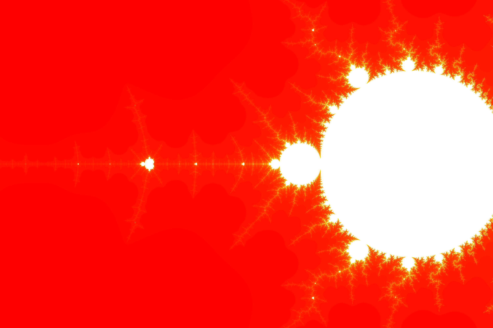
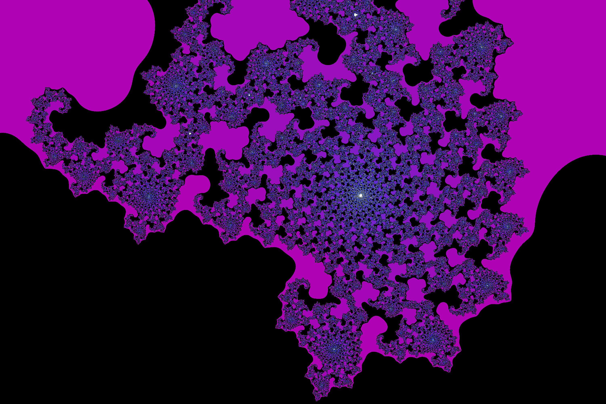

# Mandelbrot

C++ script focused on creating images of the Mandelbrot set using a language designed for easy navigation within the Mandelbrot set and many tools for choosing color palettes, image dimensions, and other metaparameters.

Disclaimer: This project relies heavily on ANSI escape codes for interactive rendering. Correct execution has not been tested anywhere other than the default Terminal for Ubuntu 18.04+.

It is recommended to use full screen and reduce the font size for comfort, or edit a few constants at the beginning of the source file.

How to build and run:

```
$ g++ -o prog prog.cpp
$ ./prog
```
or
```
$ chmod u+x make
$ ./make
$ ./prog
```


See `LANGUAGE.md` for an overview of the language or `GRAMMAR.md` for an uncommented list of commands and constructs. Help can be accessed from within the script by typing `scope ?` or simply `?`.

Below is a sample of the kind of image that can be generated. All are also available in `img/`




<br><br>


