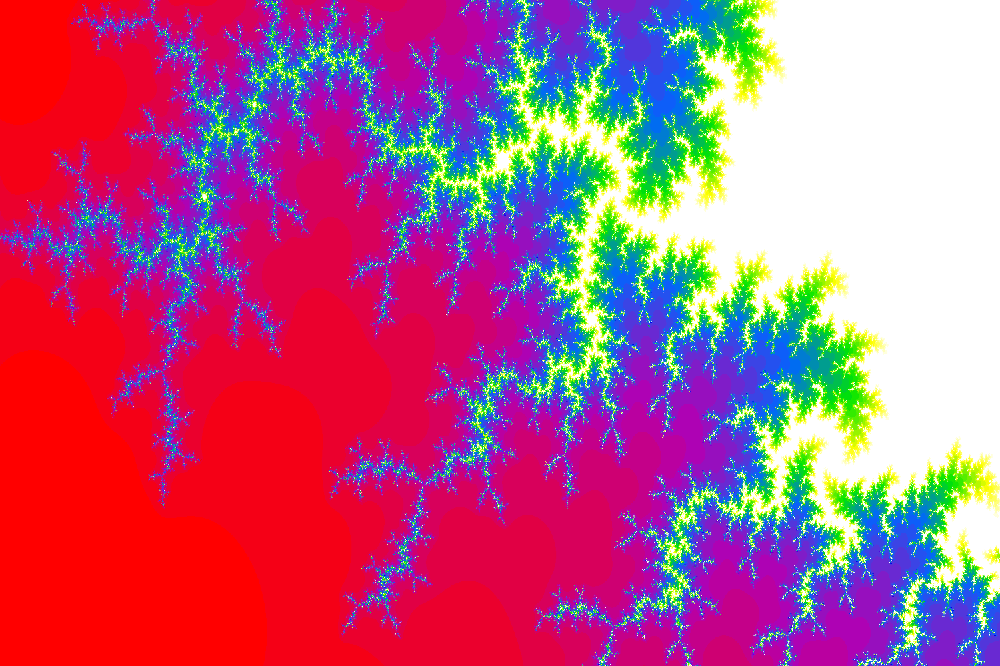
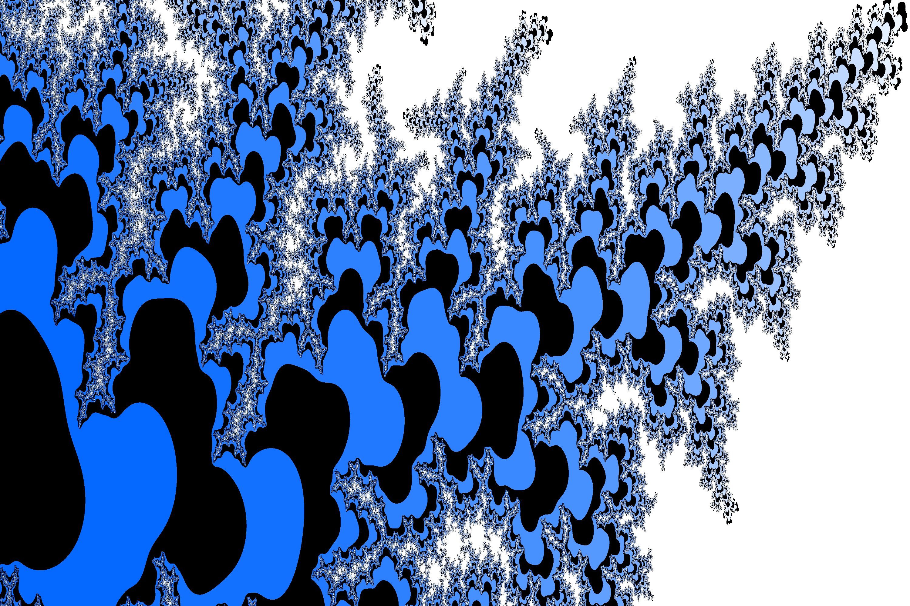

# Mandelbrot

C++ script focused on creating images of the Mandelbrot set using a language designed for easy navigation within the Mandelbrot set and many tools for choosing color palettes, image dimensions, and other metaparameters.

```diff
! NOTE
This project relies heavily on ANSI escape codes for
interactive rendering. Correct execution has not been tested
anywhere other than the default Terminal for Ubuntu 18.04+.
```

It is recommended to use the terminal in full screen and reduce the font size for comfort.

An alternative is to edit a few constants for preview size at the beginning of `src/consts.h`. Integrity of the graphical interface is not guaranteed.

How to build and run:

```
$ cd build
$ make
$ ./mandelbrot
```

See `LANGUAGE.md` for an overview of the language or `GRAMMAR.md` for an uncommented list of commands and constructs. Help can be accessed from within the script by typing `scope ?` or simply `?`.

Below is a sample of the kind of image that can be generated. All of them are also available in `img/`


 
<br>
 
<br>
 
